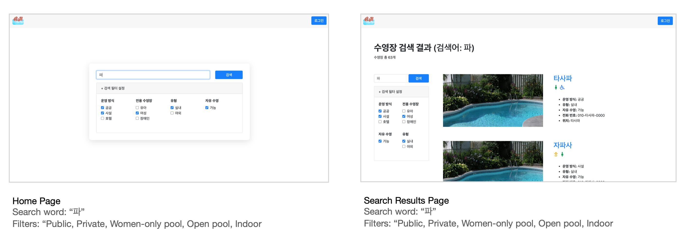

# Soodal

> Swimming pool search engine

## Table of contents

- [General info](#general-info)
- [Collaborators](#collaborators)
- [Demo](#demo)
- [Screenshots](#screenshots)
- [Technologies](#technologies)
- [Setup](#setup)
- [Scope of Functionalities](#scope-of-functionalities)
- [Project Status](#project-status)
- [Contact](#contact)

## General info

Soodal (수달) is derived from "수(soo)영장으로 달(dal)리자." It is a swimming pool search engine that allows users to search for swimming pools based on their preferences. The administrator can add, edit, and delete swimming pools too.

## Collaborators

- Frontend: [danakim21](https://github.com/danakim21)
- Backend: [tachyon83](https://github.com/tachyon83/)

## Demo

Here is a working [live demo](https://otters-pool.herokuapp.com/), deployed with heroku.

## Screenshots




## Technologies

- React.js
- Node.js

## Setup

```sh
# Clone this repository
$ git clone https://github.com/danakim21/soodal.git

# Go into the repository
$ cd soodal

# Install backend dependencies
$ npm install

# Run server at localhost:3000
$ node index.js

# Go into the frontend folder
$ cd front

# Install frontend dependencies
$ npm install

# Run the app and access it at localhost:3001
$ npm run start
```

## Scope of Functionalities

List of features ready

- Filter swimming pool search by types via query string parameters
  - Pool Types 1: Public, Private, Hotel
  - Pool Types 2: Indoor, Outdoor
  - Pool Options: Child pool, Women-only pool, Pool for disabled
  - Free swimming availability
- Pagination (Displays 4 pools at a time)
- Display details on a specific pool via https://otters-pool.herokuapp.com/pool/:id
- Administrator features
  - Login and logout
  - Display statistics on pools
    - Total number of pools
    - Number of private, public, hotel pools
    - Number of child-only, women-only, disabled-only pools
    - Number of indoor and outdoor pools
  - Add new pools
  - Search for pools
  - View details for pools
  - Edit details for pools
  - Delete pools
- 404 Page (page not found)

To Do

- Currently, accessing pools that don't exist is available (ex. https://otters-pool.herokuapp.com/pool/35100). Should get a server response if the requested pool exists, and redirect to 404 page accordingly.
- Allow sign up and login for users (not only for administrator)
- Implement redux for better state control

## Project Status

Project is: _finished_

## Contact

[@danakim21](https://danakim21.github.io/) - feel free to contact me!
